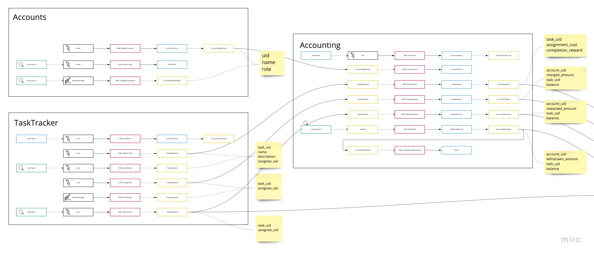
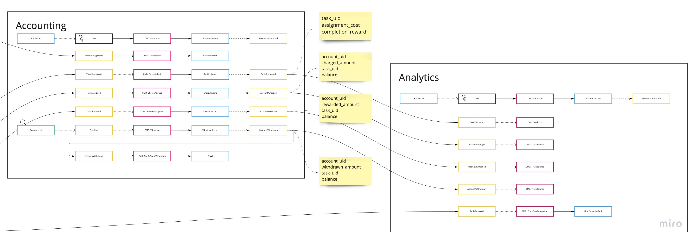
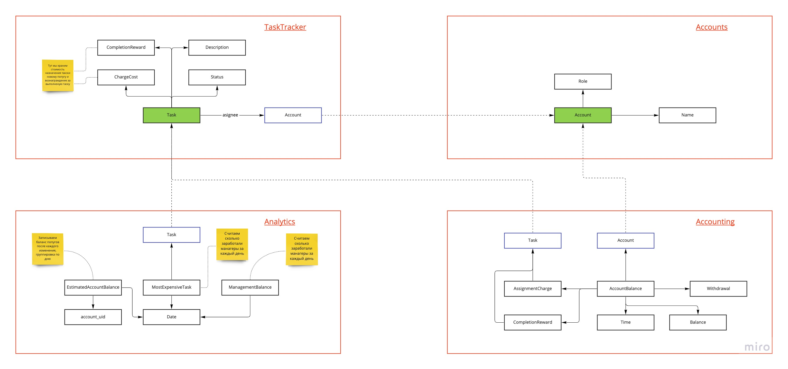

# Домашка первой недели

## Общая схема команд и событий

Я выделил четыре сервиса:

1. Accounts - управление аккаунтами и их аутентификацией
2. TaskTracker - управление задачами
3. Accounting - бухгалтерия
4. Analytics - аналитика

Все взаимодействия между сервисами асинхронные, через event log.

## Accounts and Tasks

## Accounting and Analytics

## Модель данных и доменов

Общими данными в системе являются модели `Account` и `Task`. В связанных сервисах
они должны синхронизироваться через подписку на CUD события для этих моделей.
